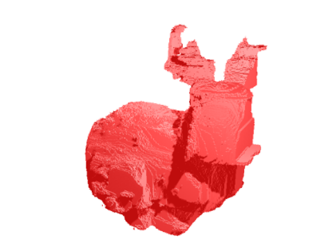
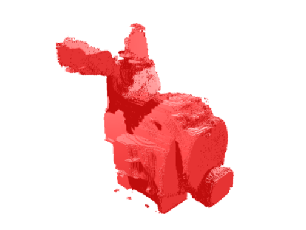
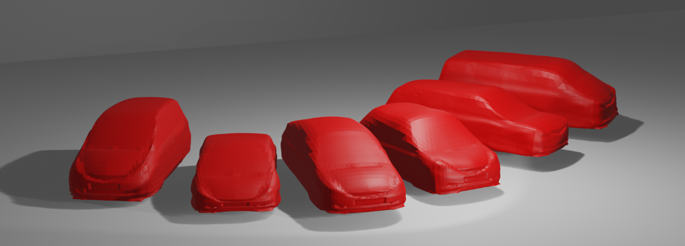

# 3D Style Transfer

This repository provides two 3D style transfer pipelines.

## Code
The source code for the voxel-based Neural Style Transfer and the Eigendecomposition-based style Transfer is organized in two seperate self-contained Jupyter Notebooks.
All information necessary to execute the notebooks is described in the notebooks themselves.

---

## Voxel-based Neural Style Transfer
, 

We provide the code necessary to reproduce the results in the following publications:

- Friedrich, T., Wollstadt, P., & Menzel, S. (2020). The Effects of Non-linear Operators in Voxel-Based Deep Neural Networks for 3D Style Reconstruction. 2020 IEEE Symposium Series on Computational Intelligence (SSCI), 1460–1468. https://doi.org/10.1109/SSCI47803.2020.9308308

- Friedrich, T., Hammer, B., & Menzel, S. (2021). Voxel-Based Three-Dimensional Neural Style Transfer. 16th International Work-Conference on Artificial Neural Networks, IWANN 2021, 334–346. https://doi.org/10.1007/978-3-030-85030-2_28

- Friedrich, T., Three-Dimensional Voxel-Based Neural Style Transfer and Quantification (Dissertation submitted)

---
## Eigendecomposition-based Style Transfer

We provide the code necessary to reproduce the results in the following publications:

- Friedrich, T., Schmitt, S., & Menzel, S. (2020). Rapid Creation of Vehicle Line-Ups By Eigenspace Projections for Style Transfer. Proceedings of the Design Society: DESIGN Conference, 1, 867–876. https://doi.org/10.1017/dsd.2020.162

- Friedrich, T., Three-Dimensional Voxel-Based Neural Style Transfer and Quantification (Dissertation submitted)

---

## Licensing
The software in this repository is licensed under the GPL-3.0. For more details on the license, please check [the license file.](LICENSE)
